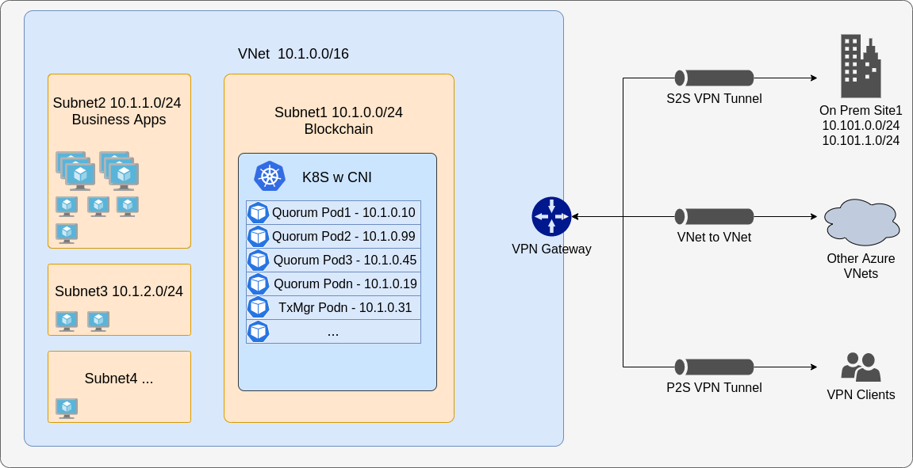

# AWS

## Background

The following is meant to guide you through running Hyperledger Besu or GoQuorum clients in AWS EKS (Kubernetes) in both development and production scenarios. As always you are free to customize the charts to suit your requirements. It is highly recommended to familiarize yourself with EKS (or equivalent Kubernetes infrastructure) before running things in production on Kubernetes.

It essentially comprises base infrastructure that is used to build the cluster & other resources in AWS via a [template]('./templates/cluster.yml'). We also make use some AWS native services and features after the cluster is created. These include:

- [Pod identities](hhttps://github.com/aws/amazon-eks-pod-identity-webhook).
- [Secrets Store CSI drivers](https://docs.aws.amazon.com/eks/latest/userguide/ebs-csi.html)
- Data is stored using dynamic StorageClasses backed by AWS EBS. Please note the [Volume Claims](https://kubernetes.io/docs/concepts/storage/persistent-volumes/#persistentvolumeclaims) are fixed sizes and can be updated as you grow via a helm update, and will not need reprovisioning of the underlying storage class.
- [CNI](https://docs.aws.amazon.com/eks/latest/userguide/pod-networking.html) networking mode for EKS. By default, EKS clusters use **kubenet**, and a virtual network and subnet are created for you. With kubenet, nodes get an IP address from a virtual network subnet. Network address translation (NAT) is then configured on the nodes, and pods receive an IP address "hidden" behind the node IP. This approach reduces the number of IP addresses that you need to reserve in your network space for pods to use, however places constraints on what can connect to the nodes from outside the cluster (eg on prem nodes)

With AWS Container Networking Interface (CNI), every pod gets an IP address from the subnet and can be accessed directly. These IP addresses must be unique across your network space, and must be planned in advance. Each node has a configuration parameter for the maximum number of pods that it supports. The equivalent number of IP addresses per node are then reserved up front for that node. This approach requires more planning, and can leads to IP address exhaustion as your application demands grow, however makes it easier for external nodes to connect to your cluster.



### Operation flow:

1. Read this file in its entirety before proceeding
2. See the [Prerequisites](#prerequisites) section to enable some features before doing the deployment
3. See the [Usage](#usage) section

#### Helm Charts:

The dev charts are aimed at getting you up and running so you can experiment with the client and functionality of the tools, contracts etc. They embed node keys etc as secrets so that these are visible to you during development and you can learn about discovery. The prod charts utilize all the built in AWS functionality and recommended best practices such as identities, secrets stored in keyvault with limited access etc. **When using the prod charts please ensure you add the necessary values to the `aws` section of the values.yml file**

#### Warning:

1. Please do not create more than one EKS cluster in the same subnet.
2. EKS clusters may **not** use _169.254.0.0/16, 172.30.0.0/16, 172.31.0.0/16, or 192.0.2.0/24_ for the Kubernetes service address range.

## Pre-requisites:

You will need to install [eksctl](https://docs.aws.amazon.com/eks/latest/userguide/getting-started-eksctl.html)

## Usage

1. Update the [cluster.yml](./templates/cluster.yml) with your VPC details
2. Deploy the template

```bash
eksctl create cluster -f ./templates/cluster.yml
```

3. Your `.kube/config` should be connected to your cluster automatically, but if not, please run the following:
```bash
aws sts get-caller-identity
aws eks --region AWS_REGION update-kubeconfig --name CLUSTER_NAME
```

4. [Provision Secrets Drivers](https://github.com/aws/secrets-store-csi-driver-provider-aws)

Once the deployment has been completed, please provision the Secrets Manager identity and the CSI drivers

```bash
./scripts/bootstrap.sh  "AWS_REGION" "AWS_ACCOUNT" "CLUSTER_NAME" "AKS_NAMESPACE"
```

| ⚠️ **Note**: The above command creates a service account called `quorum-sa`. Please use the same in the values.yml files under the `aws` map. If you would like to change the name of the service account, please remember to do it in both places |
| --------------------------------------------------------------------------------------------------------------------------------------------------------------------------------------------------------------------------------------------------------------- |

5. Provision EFS CSI Driver (optional)

The `cluster.yml` file that is included in this folder uses the EBS drivers but also deploys the EFS IAM policies ie you still need to install the EFS CSI drivers. This can be done following the [AWS Docs ](https://docs.aws.amazon.com/eks/latest/userguide/efs-csi.html)

6. Deploy the charts as per the `helm` folder readme files

The following is meant to guide you through running Hyperledger Besu or GoQuorum clients in AWS EKS (Kubernetes). As always you are free to customize the charts to suit your requirements. It is highly recommended that you familiarize yourself with EKS (or equivalent Kubernetes infrastructure) before running things in production on Kubernetes.

7. Optionally deploy the kubernetes [dashboard](./templates/k8s-dashboard/README.md)
