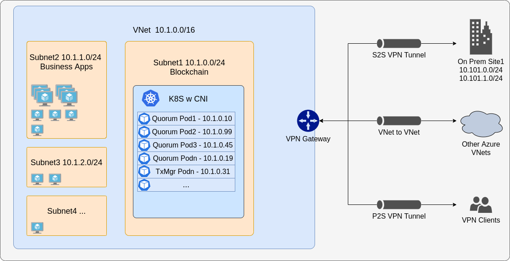

# Azure

## Background
The following is meant to guide you through running Hyperledger Besu or GoQuorum clients in Azure AKS (Kubernetes) in both development and production scenarios. As always you are free to customize the charts to suit your requirements. It is highly recommended to familiarize yourself with AKS (or equivalent Kubernetes infrastructure) before running things in production on Kubernetes.

It essentially comprises base infrastructure that is used to build the cluster & other resources in Azure via an [ARM template](./arm/azuredeploy.json). We also make use some Azure native services and features (tha are provisioned via a [script](./scripts/bootstrap.sh)) after the cluster is created. These include:
- [AAD pod identities](https://docs.microsoft.com/en-us/azure/aks/use-azure-ad-pod-identity).
- [Secrets Store CSI drivers](https://docs.microsoft.com/en-us/azure/key-vault/general/key-vault-integrate-kubernetes)
- Data is stored using dynamic StorageClasses backed by Azure Files. Please note the [Volume Claims](https://docs.microsoft.com/en-us/azure/aks/azure-disks-dynamic-pv) are fixed sizes and can be updated as you grow via a helm update, and will not need reprovisioning of the underlying storage class.
- [CNI](https://docs.microsoft.com/en-us/azure/aks/configure-azure-cni#:~:text=With%20Azure%20Container%20Networking%20Interface,of%20pods%20that%20it%20supports.) networking mode for AKS. By default, AKS clusters use **kubenet**, and a virtual network and subnet are created for you. With kubenet, nodes get an IP address from a virtual network subnet. Network address translation (NAT) is then configured on the nodes, and pods receive an IP address "hidden" behind the node IP. This approach reduces the number of IP addresses that you need to reserve in your network space for pods to use, however places constraints on what can connect to the nodes from outside the cluster (eg on prem nodes)

With Azure Container Networking Interface (CNI), every pod gets an IP address from the subnet and can be accessed directly. These IP addresses must be unique across your network space, and must be planned in advance. Each node has a configuration parameter for the maximum number of pods that it supports. The equivalent number of IP addresses per node are then reserved up front for that node. This approach requires more planning, and can leads to IP address exhaustion as your application demands grow, however makes it easier for external nodes to connect to your cluster.



If you have existing VNets, you can easily connect to the VNet with the k8s cluster by using [VNet Peering](https://docs.microsoft.com/en-us/azure/virtual-network/virtual-network-peering-overview)

## Overview:
1. Read this file in its entirety before proceeding
2. See the  [Prerequisites](#prerequisites) section to enable some features before doing the deployment
3. See the [Usage](#usage) section

#### Helm Charts:
Setiing the `cluster.stage: dev` is are aimed at getting you up and running so you can experiment with the client and functionality of the tools, contracts etc. They embed node keys etc as secrets so that these are visible to you during development and you can learn about discovery. The `cluster.stage: prod` setting utilizes all the built in Azure functionality and recommended best practices such as identities, secrets stored in keyvault with limited access etc. **When using the prod setting, please ensure you add the necessary values to the `azure` section of the values.yml file**

#### Warning:

1. Please do not create more than one AKS cluster in the same subnet.
2. AKS clusters may **not** use _169.254.0.0/16, 172.30.0.0/16, 172.31.0.0/16, or 192.0.2.0/24_ for the Kubernetes service address range.

## Pre-requisites:

You will need to run these in your Azure subscription **before** any deployments.

For this deployment we will provision AKS with CNI and a managed identity to authenticate and run operations of the cluster with other services. We also enable [AAD pod identities](https://docs.microsoft.com/en-us/azure/aks/use-azure-ad-pod-identity) which use the managed identity. This is in preview so you need to enable this feature by registering the EnablePodIdentityPreview feature:
```bash
az feature register --name EnablePodIdentityPreview --namespace Microsoft.ContainerService
```
This takes a little while and you can check on progress by:
```bash
az feature list --namespace Microsoft.ContainerService -o table
```

Then install or update your local Azure CLI with preview features
```bash
az extension add --name aks-preview
az extension update --name aks-preview
```

Create a resource group if you haven't got one ready for use.
```bash
az group create --name ExampleGroup --location "East US"
```

## Usage

1. Deploy the template
* Navigate to the [Azure portal](https://portal.azure.com), click `+ Create a resource` in the upper left corner.
* Search for `Template deployment (deploy using custom templates)` and click Create.
* Click on `Build your own template in the editor`
* Remove the contents (json) in the editor and paste in the contents of `azuredeploy.json`
* Click Save
* The template will be parsed and a UI will be shown to allow you to input parameters to provision

Alternatively use the CLI
```bash
az deployment create \
  --name blockchain-aks \
  --location eastus \
  --template-file ./arm/azuredeploy.json \
  --parameters env=dev location=eastus
```

2. Provision Drivers

Once the deployment has completed, please run the [bootstrap](../scripts/bootstrap.sh) to provision the AAD pod identity and the CSI drivers ([jq](https://stedolan.github.io/jq/) JSON processor is required)

Use `quorum` for NAMESPACE and replace AKS_RESOURCE_GROUP, AKS_CLUSTER_NAME and AKS_MANAGED_IDENTITY with that of your deployment

```bash
./scripts/bootstrap.sh "AKS_RESOURCE_GROUP" "AKS_CLUSTER_NAME" "AKS_MANAGED_IDENTITY" "NAMESPACE"
```

3. Deploy the charts as per the `helm` [readme](../helm/README.md) files

